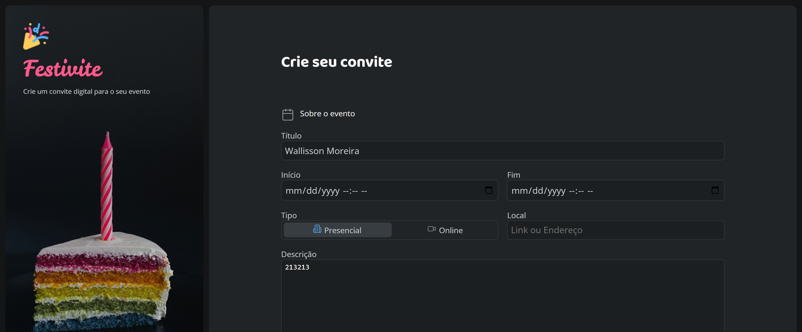
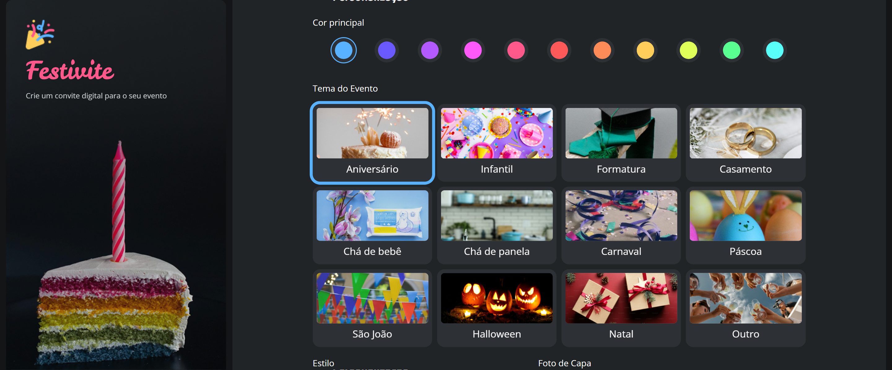
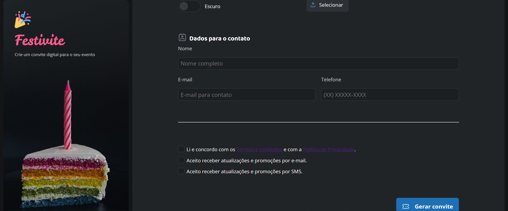
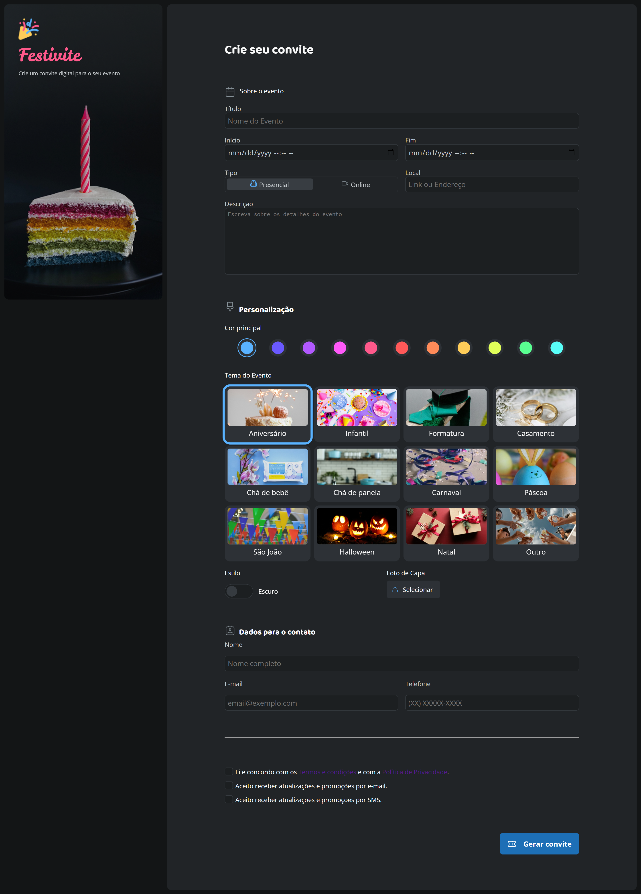

# 🎉 Festivite — Formulário de Convite Digital

> Formulário completo para criação de convites digitais, desenvolvido para praticar formulários HTML e estilização avançada com CSS.


---

## 📋 Sobre o Projeto

O **Festivite** é uma aplicação web para criação de convites digitais personalizados. O usuário pode preencher os dados do evento, escolher a cor principal, selecionar o tema da festa, alternar entre modo claro e escuro, fazer upload de foto de capa e informar seus dados de contato. O projeto foi desenvolvido com foco em **formulários HTML** com múltiplos tipos de inputs e **estilização modular com CSS**.

---

## ✨ Funcionalidades

- ✅ Campos de texto, data/hora e textarea para dados do evento
- ✅ Seleção de modalidade: **Presencial** ou **Online**
- ✅ Paleta de **11 cores** para personalização visual
- ✅ **12 temas de evento** (Aniversário, Casamento, Halloween, Natal e mais)
- ✅ Toggle de **modo claro / escuro**
- ✅ Upload de **foto de capa**
- ✅ Seção de dados de contato com validação de campos obrigatórios
- ✅ Checkboxes de aceite de **termos e condições**
- ✅ Tipografia com as fontes **Baloo 2**, **Leckerli One** e **Open Sans**

---

## 🖼️ Preview

| Topo | Meio | Fim |
|------|------|-----|
|  |  |  |

**Visão completa:**



---

## 🛠️ Tecnologias Utilizadas

| Tecnologia | Finalidade |
|------------|------------|
| HTML5 | Estrutura semântica e elementos de formulário |
| CSS3 | Estilização modular, variáveis e layout |
| Google Fonts | Baloo 2, Leckerli One e Open Sans |

---

## 🧠 Foco Técnico — Formulários HTML

Este projeto foi pensado como um laboratório completo de formulários. Alguns conceitos aplicados:

- Uso de `<form>`, `<fieldset>` e `<legend>` para organização semântica
- Múltiplos tipos de `<input>`: `text`, `email`, `number`, `radio`, `checkbox`, `datetime-local`, `file`
- `<textarea>` para campos de texto longo
- `<label>` associado corretamente a cada input para acessibilidade
- Atributo `required` para validação nativa de campos obrigatórios
- Estilização avançada de inputs customizados (radio, checkbox, toggle e color picker)
- Separação de estilos em arquivo dedicado dentro de `styles/`

---

## 📁 Estrutura de Pastas

```
📦 formulario-de-convite
├── 📄 index.html
├── 📁 styles/
│   └── style.css
├── 📁 assets/
│   ├── Logo.png
│   ├── calendar.svg
│   ├── upload.svg
│   ├── ticket.svg
│   └── (ícones dos temas: aniversario.svg, casamento.svg, natal.svg...)
└── 📁 previews/
    ├── preview-top.png
    ├── preview-middle.png
    ├── preview-end.png
    └── preview-fullsize.png
```

---

## 🚀 Como Visualizar o Projeto

1. Clone o repositório:
```bash
git clone https://github.com/WallissonDev/formulario-de-convite.git
```

2. Acesse a pasta do projeto:
```bash
cd formulario-de-convite
```

3. Abra o arquivo `index.html` no navegador.

---

## 📚 Aprendizados

- Domínio de **formulários HTML** com diversos tipos de input
- Estilização de elementos nativos como **radio buttons**, **checkboxes** e **toggles** com CSS puro
- Uso de **variáveis CSS** para consistência visual e troca de temas
- Organização de **CSS modular** em arquivo separado
- Aplicação de **múltiplas fontes** do Google Fonts em um único projeto

---

## 👤 Autor

**Wallisson Moreira de Lima**

[](https://github.com/WallissonDev)

---

*Feito com 💙 e muito HTML de formulário.*
